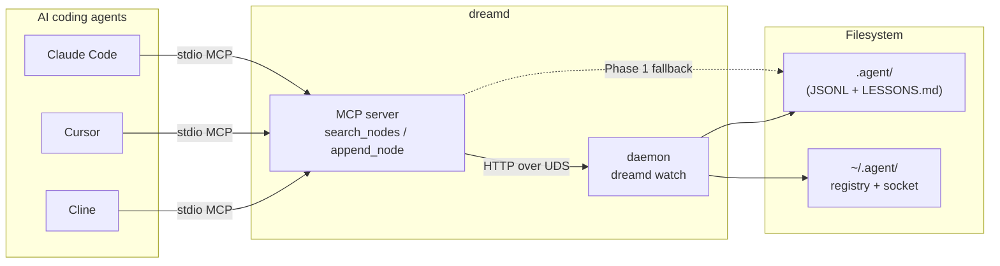
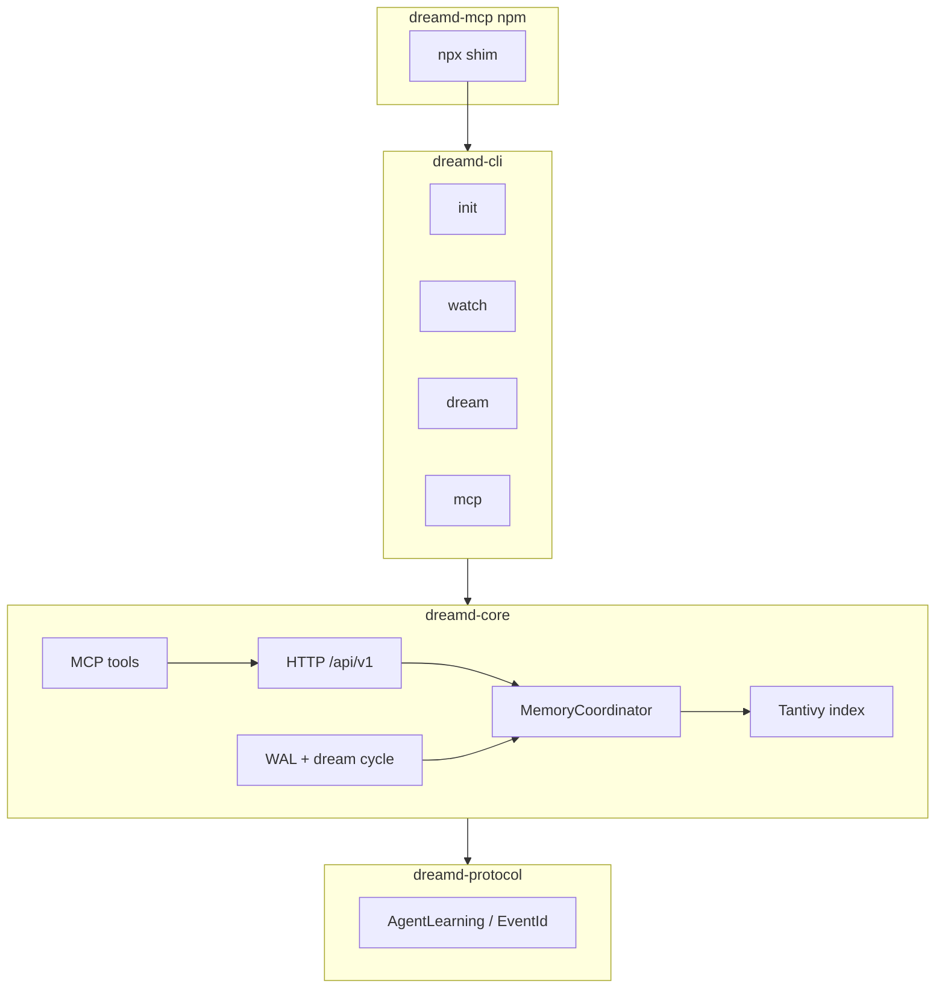
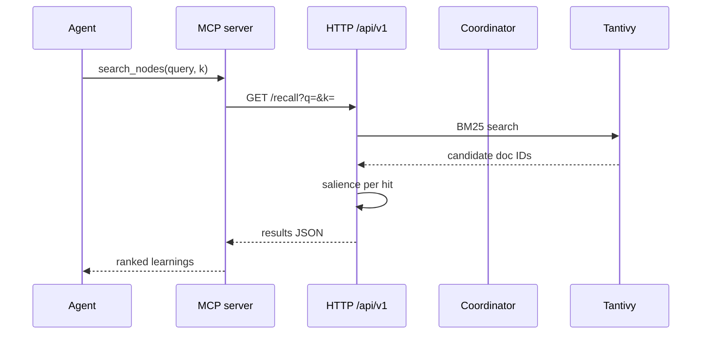
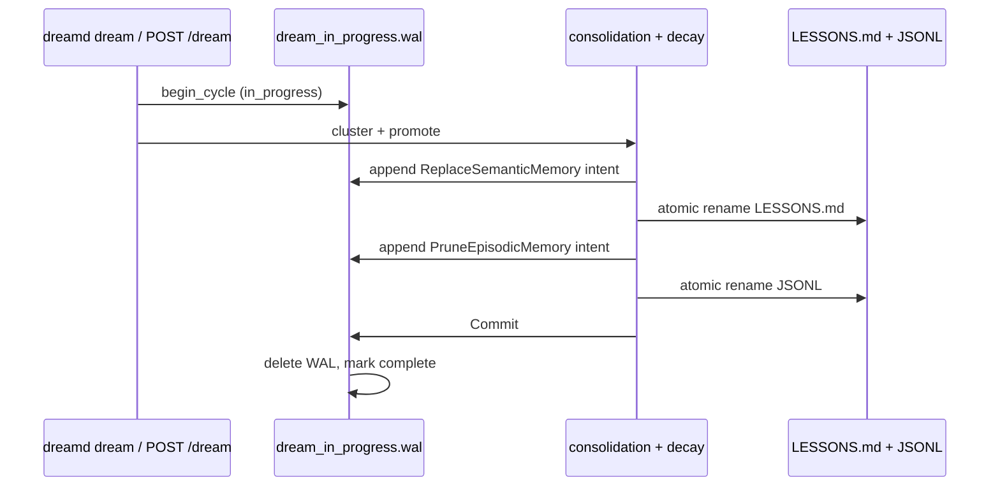

# dreamd — Architecture

Engineering invariants for the reference implementation. Read this before changing the coordinator, index, HTTP API, MCP server, or dream cycle.

For the on-disk memory contract (folder layout, JSON schema, scoring formula), see [`SPEC.md`](./SPEC.md). For the threat model, see [`SECURITY.md`](./SECURITY.md).

## System context



## Container diagram



## Crate layout

| Crate | Role |
|---|---|
| `dreamd-protocol` | Shared serde types only (`serde`, `chrono`, `serde_json`). Parse/validate boundary for `EventId` and HTTP schemas. |
| `dreamd-core` | Memory engine: coordinator actor, HTTP API, Tantivy index, dream cycle, MCP server. |
| `dreamd` (`dreamd-cli`) | CLI binary: `init`, `mcp`, `watch`, `dream`, `doctor`, `version`. |
| `packages/dreamd-mcp` | Node.js shim (`npx dreamd-mcp`) that downloads the prebuilt binary. |

State management is an **actor model**: a single `MemoryCoordinator` task owns mutable state. Do not introduce parallel writers to JSONL or the index — every mutation goes through the coordinator. `&mut self` on the run loop is the exclusivity guarantee (no `Mutex<File>` inside the actor).

## Data flow: `append_node` → disk + index

Tracing one learning from MCP ingress to durable storage:

| Step | Module | What happens |
|---|---|---|
| 1 | `mcp/mod.rs` | `append_node` tool receives params; builds `AgentLearning` |
| 2 | `mcp/mod.rs` | Phase 2: HTTP `POST /learn` over UDS; Phase 1: local coordinator |
| 3 | `server/http.rs` | `post_learn` — validate `skill_action`, redact, dispatch |
| 4 | `coordinator.rs` | Mint `EventId`, stamp schema, `write_all` + `sync_data` to JSONL |
| 5 | `server/tantivy_handle.rs` | Indexer actor appends document; 5 s commit cadence |
| 6 | `episodic/AGENT_LEARNINGS.jsonl` | Durable line on disk (source of truth) |

Recall path: `search_nodes` → `GET /recall` → `recall()` + `SalienceCollector` (`salience.rs`, `collector.rs`) → ranked JSON.

## Search sequence



## Load-bearing decisions

### 1. JSONL append durability

All appends to `episodic/AGENT_LEARNINGS.jsonl` flow through one `MemoryCoordinator` actor.

Write order:

1. Idempotency-LRU lookup
2. Mint `EventId` (`evt_` + 26-char Crockford ULID in `dreamd-core`; inbound `id` is overwritten)
3. Serialize with trailing `\n`
4. Reject lines > 4 KiB (`PayloadTooLarge` → HTTP 413)
5. Single `write_all` → `sync_data`
6. LRU `put` only on success (insert-after-sync)

`POST /api/v1/learn` returns 201 only after `sync_data` completes. Idempotency LRU is in-memory only (cap 1024, keyed by canonicalized agent-root path + `client_dedup_key`); restart clears it.

On startup, `truncate_malformed_tail` retains lines up to the last cleanly parseable `\n`-terminated record and truncates torn tails. Writers must never emit blank lines.

Concurrent third-party writers to the JSONL are not supported in v0.1.

### 2. Salience is query-time, not indexed

Storing the score would force daily re-indexing as `age_days` drifts. Tantivy schema fields: `content` (TEXT), `timestamp_sec`, `pain`, `importance`, `recurrence` (fastfields), plus the `STRING | STORED` provenance anchors `skill_action` and `source_harness` (hydrated into recall `metadata`, WEG-424 — stored for surfacing, not salience inputs). A custom collector computes:

```
salience = exp(-age_days / 14.0) * (pain / 10.0) * (importance / 10.0) * (1.0 + ln(1.0 + recurrence))
final_score = bm25 * salience
```

Indexing is incremental (5-second commit cadence), never a nightly rebuild.

### 3. Dream cycle WAL

Before any destructive op (replacing `LESSONS.md`, pruning JSONL), write `dream_in_progress.wal` with `WalIntent` entries (`ReplaceSemanticMemory`, `PruneEpisodicMemory`, `Commit`). On startup, if the WAL exists, run compensating cleanup before serving traffic. `.agent/` must be either pre- or post-cycle, never mid-cycle.

**v0.1 scope:** WAL protects JSONL, `LESSONS.md`, and recurrence sidecar writes only. Tantivy index mutations are **not** WAL-protected.



### 4. Index freshness vs JSONL durability (v0.1 contract)

`episodic/AGENT_LEARNINGS.jsonl` is the source of truth. The Tantivy index is a derived, best-effort recall cache.

| Layer | Durability | Recovery |
|---|---|---|
| JSONL append | `write_all` + `sync_data` before HTTP 201 | `truncate_malformed_tail` on coordinator open |
| Dream cycle | WAL before destructive ops | `recover_on_startup` |
| Tantivy index | 5 s commit cadence; coordinator → indexer `try_send` (drops on `Full`) | Startup two-pass replay in `TantivyIndexHandle::open` |

**Coordinator → indexer hand-off.** After each durable JSONL append, the coordinator `try_send`s `IndexerMsg::Append` on a bounded channel (`DEFAULT_INDEXER_CHANNEL_CAPACITY = 1024`). On `TrySendError::Full`, the message is logged and dropped — the append still succeeds. On `Closed`, the sender is dropped and live indexing stops until restart.

**Bounded recall staleness.** The indexer commits on a wall-clock cadence (default 5 s). Between append and commit, `index_progress.json` lags the JSONL tail; recall may miss very recent events for up to one commit window. Channel saturation or a crash between JSONL `sync_data` and the next Tantivy commit can extend that lag until the next `TantivyIndexHandle::open` replay.

**Observable signal.** `assess_index_freshness(agent_root)` compares the JSONL tail to `index_progress.json` and reports `stale`, `unindexed_count`, and both IDs. Surfaces at:

- `GET /api/v1/health` (per project, requires `X-Agent-Root`)
- `dreamd doctor` (`index_freshness:` line)

**Healing.** `TantivyIndexHandle::open` replays every JSONL event whose `EventId` is strictly greater than the on-disk watermark. `add_document` is idempotent; replay re-does at most one commit window after crash. v0.1.1 may add indexer backpressure instead of drop-on-full.

**Schema-version migration.** The index carries an `index_manifest.json` version (`SCHEMA_VERSION`, e.g. `index/1.3`). On open, a manifest older than the binary's (`NeedsMigration`) triggers a full rebuild: `TantivyIndexHandle::open` wipes the index dir + progress watermark, replays the JSONL under the current schema, and re-stamps the manifest — on both the daemon and no-daemon paths. This is why an index-schema field add (e.g. WEG-424's `skill_action`/`source_harness`) self-heals on upgrade rather than needing `dreamd migrate` (§7, which governs the durable JSONL/state schema, not the derived index cache). A manifest *newer* than the binary aborts startup.

### 5. Local API security

- **Unix (v0.1):** HTTP binds to a Unix domain socket at `~/.agent/dreamd.sock` with `0600` permissions. Every request validates the connecting peer's UID via `SO_PEERCRED` (Linux) or `getpeereid` (macOS); mismatched UIDs are rejected.
- **Windows:** bearer-token auth on `127.0.0.1` — deferred to v0.1.1.
- TCP binding to non-localhost will be refused unless `--insecure` is passed — deferred to v0.1.1.

### 6. MCP tool names

The MCP server exposes `search_nodes` (→ `GET /api/v1/recall`) and `append_node` (→ `POST /api/v1/learn`). These names match the Anthropic reference memory server intentionally — do not rename.

`npx dreamd-mcp` is the primary v0.1 distribution surface.

### 7. Schema versioning

Every persisted episodic record carries `schema_version: "1.0.0"`; daemon `state.json` carries `schema_version: "1.0"` (independent version streams). Add a `dreamd migrate` path before changing either version.

### 8. `unsafe` policy

Workspace lint is `unsafe_code = "forbid"`. `dreamd-core` has a scoped `"deny"` override for `detach_double_fork` only, with an explicit SAFETY contract. Do not widen the downgrade.

### 9. SkillAction validation seam

**Decision: ingress-only validation forever.** Read-time normalization in the episodic store was considered and rejected for v0.1.

| Layer | Validates `skill_action`? | Notes |
|---|---|---|
| HTTP `POST /learn` | yes | `LearnIngress::prepare_agent_learning` → `SkillAction::parse` |
| MCP `append_node` (local) | yes | `LearnIngress::build_agent_learning` |
| MCP `append_node` (remote) | yes | daemon `post_learn` re-validates |
| Coordinator `handle_append` | **no** | trusts ingress; mints `EventId`, stamps schema, fsyncs |
| Dream cycle / recall | **no** | reads the on-disk `String` as-is |

**Why `AgentLearning.skill_action` stays `String`.** Serde must accept hand-edited JSONL and pre-migration records (dotted keys like `rust.error_handling`) without a custom deserializer. Removing the [`SkillAction`](crates/dreamd-protocol/src/lib.rs) type does not break serde of existing records — it only removes the ingress gate.

**Why not read-time normalization.** A normalization layer in the episodic store would silently rewrite keys on every read, breaking the "filesystem is source of truth" contract and making `cat`/`grep` disagree with in-memory clustering. It also adds per-line overhead on every dream cycle and index replay with no v0.1 caller.

**Legacy on-disk keys.** The dream cycle clusters by splitting on `::` only (`consolidation.rs`). Dotted pre-migration keys are treated as opaque single-segment keys — `rust.error_handling` does **not** merge with `rust::error_handling`. This is intentional until `dreamd migrate` rewrites them (deferred; see schema versioning §7).

**Invariant tests.** `consolidation` unit tests pin legacy dotted-key clustering; `dreamd-protocol` tests confirm dotted records round-trip through serde without `SkillAction`.

### 10. Observability

`dreamd_core::observability::init_tracing` installs the process-wide `tracing` subscriber once, at the top of `cli::run()` before subcommand dispatch — the facade and its macro callsites already exist crate-wide, so this baseline is what makes them emit. Two layers:

- **Console → stderr, always.** stdout is reserved for the MCP JSON-RPC channel (`rmcp::transport::stdio`), so logs must never write to it. Pretty human-readable text when stderr is a TTY, JSON when it is not (CI, service-managed daemon); TTY detection uses `std::io::IsTerminal`, not the `atty` crate.
- **File → `~/.agent/dreamd.log`, JSON always.** Written through a non-blocking `tracing-appender`; the returned `WorkerGuard` is bound as `_log_guard` in `run()` and held until the process exits — dropping it early discards buffered file logs. Truncated at startup for v0.1; rotation is deferred to v0.1.1 (WEG-379). The path resolves via `DaemonHome::log_file()`, never hardcoded.

Log level comes from `DREAMD_LOG` (standard `EnvFilter` syntax, default `info`), owned here rather than by the config loader. `init_tracing` uses `try_init` (idempotent) and degrades to console-only — returning `None` — when the log directory is not writable.

### 11. Portable-memory substrate: canonical natural language, never model-internal representations

**Decision.** The unit of portable memory is the natural-language `content` field on `AgentLearning` (`crates/dreamd-protocol/src/lib.rs`), retrieved lexically (BM25 × salience, §2). dreamd never stores or serves model-internal representations — hidden states, activations, or per-harness embeddings. Provenance travels as plain scalars (`source_harness`, `skill_action`), never as vectors.

**Why.** A learning is only worth keeping if a *different* model or harness than the one that wrote it can consume it. A representation produced in one model's geometry — an embedding from harness A's encoder — is off-manifold for harness B: decodable is not consumable. Natural language is the one representation every model and harness was trained to read, so it is the only substrate that is portable by construction. (Mechanism reference: the cross-boundary representational-drift result for looped transformers — DiscoLoop, Fu et al., UC Berkeley/Princeton — where a bridge vector that decodes to the correct token at ~100% probability still sits at cosine ≈0.33 to the clean embedding the next consumer expects.)

**Dual channel — by design, not one format.**

| Channel | Store | Role |
|---|---|---|
| Rich / raw | `episodic/AGENT_LEARNINGS.jsonl` (append-only, §1) | full-fidelity capture; source of truth |
| Canonical | `LESSONS.md` via the dream cycle (§3) | distilled, harness-agnostic, consumable cross-harness |

The dream cycle is the re-encode-at-the-boundary step: producing harness-agnostic phrasing is an explicit goal of consolidation, not a side effect.

**Guardrail for the v0.1.1 semantic indexer (DR-211).** If semantic retrieval is added, the embedding is a **retrieval index only, never the stored or served payload**, and it must use a **single dreamd-controlled neutral encoder** — never each harness's own encoder. Per-harness embeddings reintroduce exactly the cross-geometry drift this decision exists to avoid.

**Validation.** Portability is proven by a cross-harness out-of-distribution split — write with harness A, recall with an independent harness B that never touched the write (`scripts/alpha/`) — never by same-harness round-trip. Substring presence is the floor; frame-completeness (the recall payload carries `source_harness` + `skill_action`) and paraphrase recall are the portability metric.

## HTTP API

All endpoints are JSON over `/api/v1` on the Unix domain socket. Full reference: [`docs/http-api.md`](./docs/http-api.md).

| Method | Path | Notes |
|---|---|---|
| `POST` | `/learn` | Append episodic event; 201 after `sync_data` |
| `GET` | `/recall?q=&k=` | BM25 × salience search |
| `POST` | `/dream` | Synchronous cycle; 200 `{"status":"ok"}` |
| `GET` | `/health` | Index freshness vs JSONL tail |
| `GET` | `/preferences` | User preferences from `personal/` |

Requests that target a project store must include the `X-Agent-Root` header with the **canonical project root path** (parent of `.agent/`, registered in `~/.agent/registry.toml`).

## MCP topology

- **Phase 1 (standalone):** `dreamd mcp` / `npx dreamd-mcp` runs an in-process server when no daemon is reachable. Safe for single-agent or sequential use.
- **Phase 2 (daemon bridge):** When `dreamd watch` is running, MCP auto-detects the UDS and routes through the shared daemon — the single serialized writer.

For multiple agents writing to the same project simultaneously, run one `dreamd watch` (or `npx dreamd-mcp watch`) per machine.

## Performance targets

| Metric | Target |
|---|---|
| Idle daemon RSS | < 30 MB |
| Stripped release binary | < 15 MB |
| Recall P50 warm at 10k | < 5 ms |
| Recall P99 cold at 10k | < 50 ms |

Run `cargo bench -p dreamd-core` when changing index, scoring, or hot-path code.

## Source map (common edits)

| Concern | Path |
|---|---|
| Coordinator / JSONL | `crates/dreamd-core/src/coordinator.rs` |
| HTTP handlers | `crates/dreamd-core/src/server/http.rs` |
| Daemon boot | `crates/dreamd-core/src/server/watch.rs` |
| MCP tools | `crates/dreamd-core/src/mcp/mod.rs` |
| Dream cycle | `crates/dreamd-core/src/consolidation.rs`, `decay.rs`, `wal.rs` |
| Salience | `crates/dreamd-core/src/salience.rs` |
| Wire types | `crates/dreamd-protocol/src/lib.rs` |
| CLI | `crates/dreamd-cli/src/cli.rs` |
