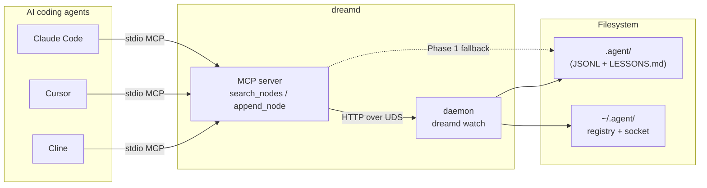
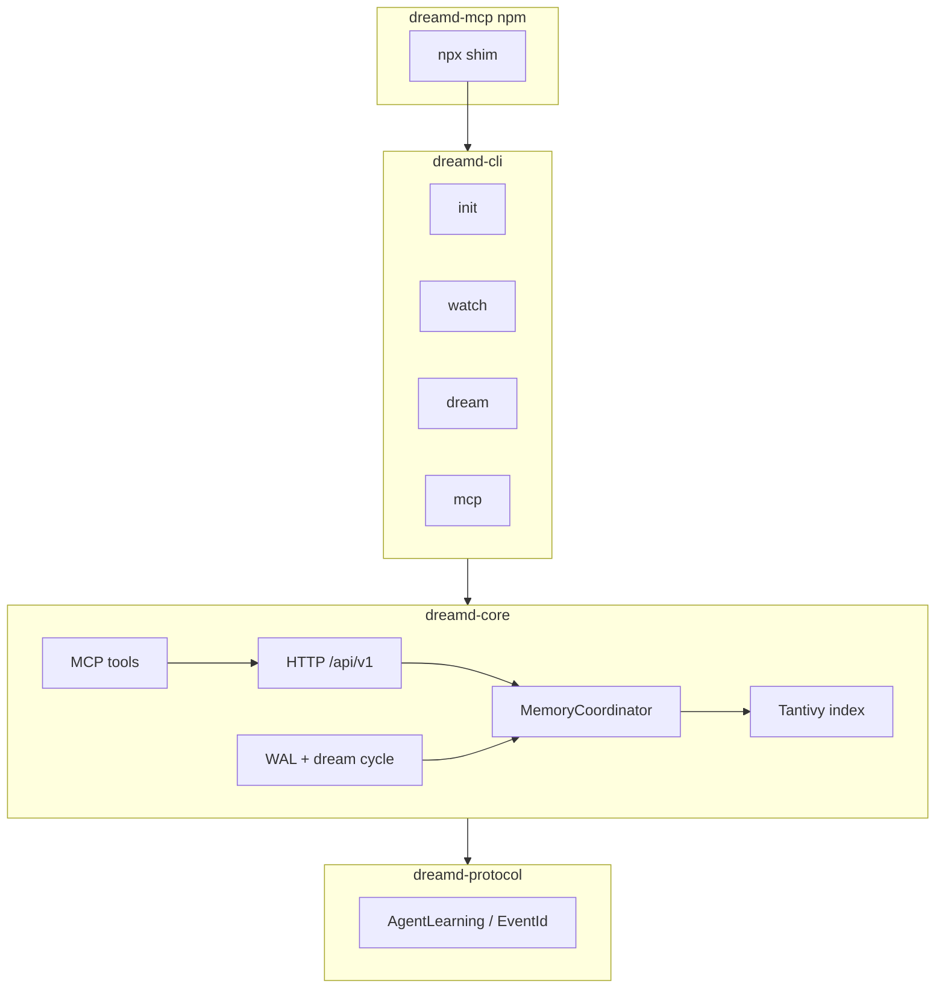
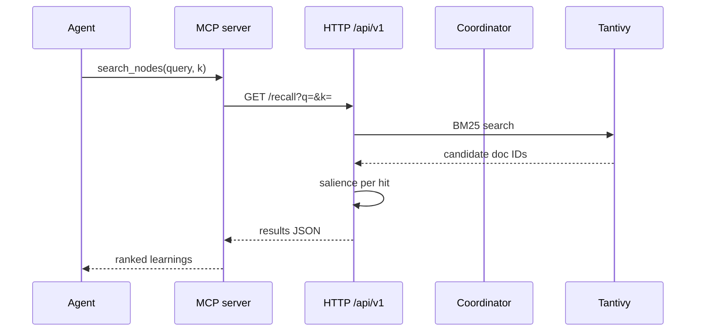
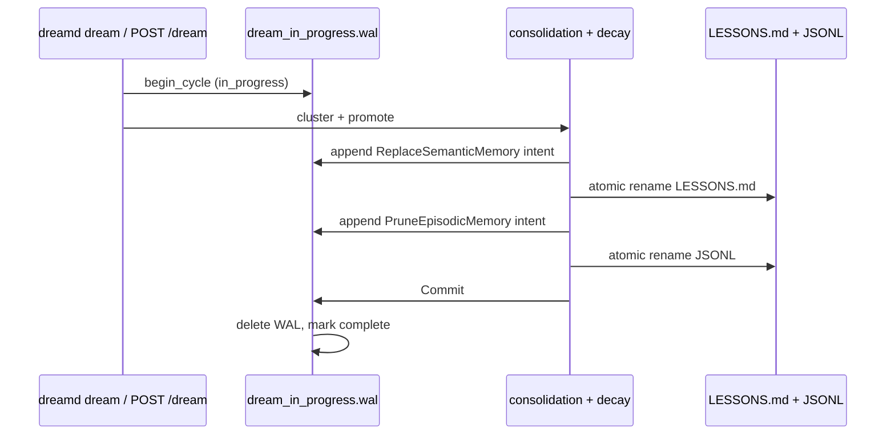

# dreamd — Architecture

Engineering invariants for the reference implementation. Read this before changing the coordinator, index, HTTP API, MCP server, or dream cycle.

For the on-disk memory contract (folder layout, JSON schema, scoring formula), see [`SPEC.md`](./SPEC.md). For the threat model, see [`SECURITY.md`](./SECURITY.md).

## System context



## Container diagram



## Crate layout

| Crate | Role |
|---|---|
| `dreamd-protocol` | Shared serde types only (`serde`, `chrono`, `serde_json`). Parse/validate boundary for `EventId` and HTTP schemas. |
| `dreamd-core` | Memory engine: coordinator actor, HTTP API, Tantivy index, dream cycle, MCP server. |
| `dreamd` (`dreamd-cli`) | CLI binary: `init`, `mcp`, `watch`, `dream`, `doctor`, `version`. |
| `packages/dreamd-mcp` | Node.js shim (`npx dreamd-mcp`) that downloads the prebuilt binary. |

State management is an **actor model**: a single `MemoryCoordinator` task owns mutable state. Do not introduce parallel writers to JSONL or the index — every mutation goes through the coordinator. `&mut self` on the run loop is the exclusivity guarantee (no `Mutex<File>` inside the actor).

## Data flow: `append_node` → disk + index

Tracing one learning from MCP ingress to durable storage:

| Step | Module | What happens |
|---|---|---|
| 1 | `mcp/mod.rs` | `append_node` tool receives params; builds `AgentLearning` |
| 2 | `mcp/mod.rs` | Phase 2: HTTP `POST /learn` over UDS; Phase 1: local coordinator |
| 3 | `server/http.rs` | `post_learn` — validate `skill_action`, redact, dispatch |
| 4 | `coordinator.rs` | Mint `EventId`, stamp schema, `write_all` + `sync_data` to JSONL |
| 5 | `server/tantivy_handle.rs` | Indexer actor appends document; 5 s commit cadence |
| 6 | `episodic/AGENT_LEARNINGS.jsonl` | Durable line on disk (source of truth) |

Recall path: `search_nodes` → `GET /recall` → `recall()` + `SalienceCollector` (`salience.rs`, `collector.rs`) → ranked JSON.

## Search sequence



## Load-bearing decisions

### 1. JSONL append durability

All appends to `episodic/AGENT_LEARNINGS.jsonl` flow through one `MemoryCoordinator` actor.

Write order:

1. Idempotency-LRU lookup
2. Mint `EventId` (`evt_` + 26-char Crockford ULID in `dreamd-core`; inbound `id` is overwritten)
3. Serialize with trailing `\n`
4. Reject lines > 4 KiB (`PayloadTooLarge` → HTTP 413)
5. Single `write_all` → `sync_data`
6. LRU `put` only on success (insert-after-sync)

`POST /api/v1/learn` returns 201 only after `sync_data` completes. Idempotency LRU is in-memory only (cap 1024, keyed by canonicalized agent-root path + `client_dedup_key`); restart clears it.

On startup, `truncate_malformed_tail` retains lines up to the last cleanly parseable `\n`-terminated record and truncates torn tails. Writers must never emit blank lines.

Concurrent third-party writers to the JSONL are not supported in v0.1.

### 2. Salience is query-time, not indexed

Storing the score would force daily re-indexing as `age_days` drifts. Tantivy schema fields: `content` (TEXT), `timestamp_sec`, `pain`, `importance`, `recurrence` (fastfields). A custom collector computes:

```
salience = exp(-age_days / 14.0) * (pain / 10.0) * (importance / 10.0) * (1.0 + ln(1.0 + recurrence))
final_score = bm25 * salience
```

Indexing is incremental (5-second commit cadence), never a nightly rebuild.

### 3. Dream cycle WAL

Before any destructive op (replacing `LESSONS.md`, pruning JSONL), write `dream_in_progress.wal` with `WalIntent` entries (`ReplaceSemanticMemory`, `PruneEpisodicMemory`, `Commit`). On startup, if the WAL exists, run compensating cleanup before serving traffic. `.agent/` must be either pre- or post-cycle, never mid-cycle.



### 4. Local API security

- **Unix (v0.1):** HTTP binds to a Unix domain socket at `~/.agent/dreamd.sock` with `0600` permissions. Every request validates the connecting peer's UID via `SO_PEERCRED` (Linux) or `getpeereid` (macOS); mismatched UIDs are rejected.
- **Windows:** bearer-token auth on `127.0.0.1` — deferred to v0.1.1.
- TCP binding to non-localhost will be refused unless `--insecure` is passed — deferred to v0.1.1.

### 5. MCP tool names

The MCP server exposes `search_nodes` (→ `GET /api/v1/recall`) and `append_node` (→ `POST /api/v1/learn`). These names match the Anthropic reference memory server intentionally — do not rename.

`npx dreamd-mcp` is the primary v0.1 distribution surface.

### 6. Schema versioning

Every persisted episodic record carries `schema_version: "1.0.0"`; daemon `state.json` carries `schema_version: "1.0"` (independent version streams). Add a `dreamd migrate` path before changing either version.

### 7. `unsafe` policy

Workspace lint is `unsafe_code = "forbid"`. `dreamd-core` has a scoped `"deny"` override for `detach_double_fork` only, with an explicit SAFETY contract. Do not widen the downgrade.

## HTTP API

All endpoints are JSON over `/api/v1` on the Unix domain socket. Full reference: [`docs/http-api.md`](./docs/http-api.md).

| Method | Path | Notes |
|---|---|---|
| `POST` | `/learn` | Append episodic event; 201 after `sync_data` |
| `GET` | `/recall?q=&k=` | BM25 × salience search |
| `POST` | `/dream` | Synchronous cycle; 200 `{"status":"ok"}` |
| `GET` | `/preferences` | User preferences from `personal/` |

Requests that target a project store must include the `X-Agent-Root` header with the **canonical project root path** (parent of `.agent/`, registered in `~/.agent/registry.toml`).

## MCP topology

- **Phase 1 (standalone):** `dreamd mcp` / `npx dreamd-mcp` runs an in-process server when no daemon is reachable. Safe for single-agent or sequential use.
- **Phase 2 (daemon bridge):** When `dreamd watch` is running, MCP auto-detects the UDS and routes through the shared daemon — the single serialized writer.

For multiple agents writing to the same project simultaneously, run one `dreamd watch` (or `npx dreamd-mcp watch`) per machine.

## Performance targets

| Metric | Target |
|---|---|
| Idle daemon RSS | < 30 MB |
| Stripped release binary | < 15 MB |
| Recall P50 warm at 10k | < 5 ms |
| Recall P99 cold at 10k | < 50 ms |

Run `cargo bench -p dreamd-core` when changing index, scoring, or hot-path code.

## Source map (common edits)

| Concern | Path |
|---|---|
| Coordinator / JSONL | `crates/dreamd-core/src/coordinator.rs` |
| HTTP handlers | `crates/dreamd-core/src/server/http.rs` |
| Daemon boot | `crates/dreamd-core/src/server/watch.rs` |
| MCP tools | `crates/dreamd-core/src/mcp/mod.rs` |
| Dream cycle | `crates/dreamd-core/src/consolidation.rs`, `decay.rs`, `wal.rs` |
| Salience | `crates/dreamd-core/src/salience.rs` |
| Wire types | `crates/dreamd-protocol/src/lib.rs` |
| CLI | `crates/dreamd-cli/src/cli.rs` |
