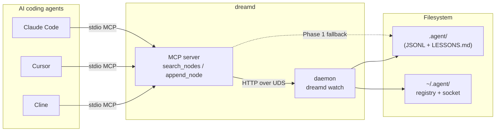
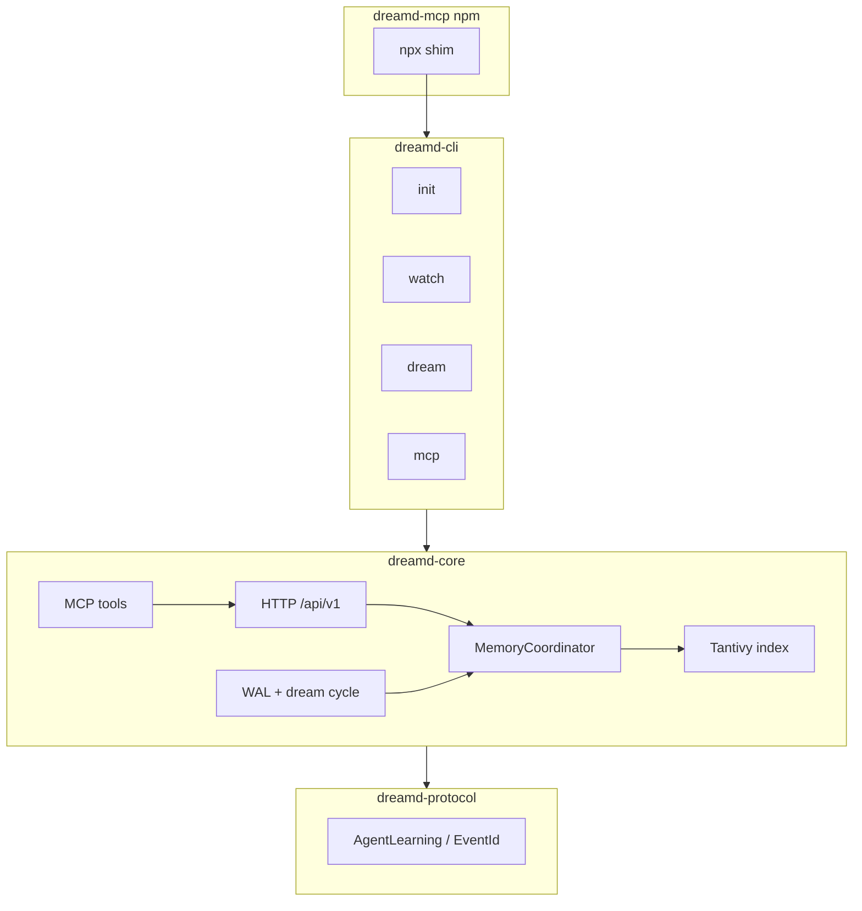
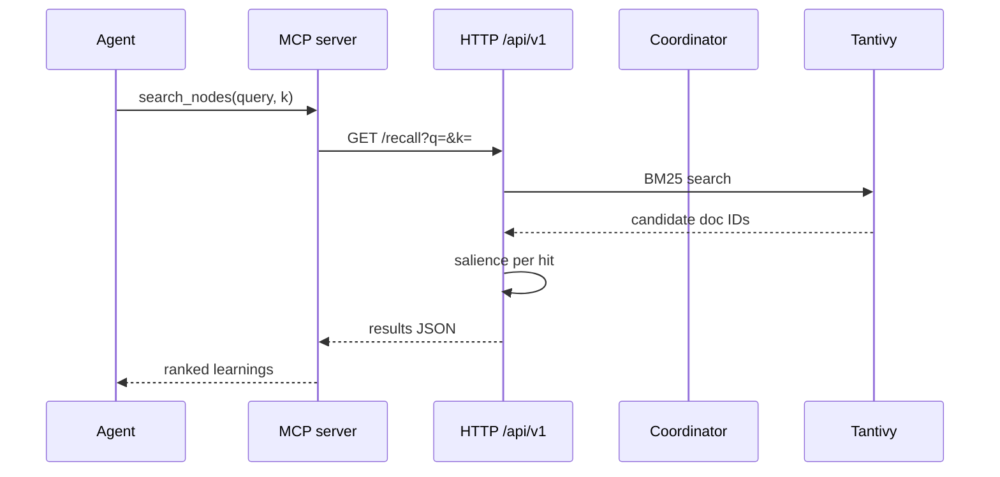
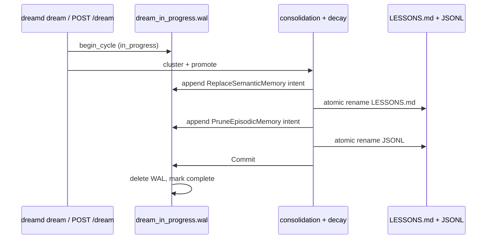

# dreamd — Architecture

Engineering invariants for the reference implementation. Read this before changing the coordinator, index, HTTP API, MCP server, or dream cycle.

For the on-disk memory contract (folder layout, JSON schema, scoring formula), see [`SPEC.md`](./SPEC.md). For the threat model, see [`SECURITY.md`](./SECURITY.md).

## System context


```mermaid
flowchart LR
    subgraph agents [AI coding agents]
        CC[Claude Code]
        CU[Cursor]
        CL[Cline]
    end

    subgraph dreamd [dreamd]
        MCP[MCP server\nsearch_nodes / append_node]
        DAE[daemon\ndreamd watch]
    end

    subgraph fs [Filesystem]
        AG[".agent/\n(JSONL + LESSONS.md)"]
        HOME["~/.agent/\nregistry + socket"]
    end

    CC & CU & CL -->|stdio MCP| MCP
    MCP -->|HTTP over UDS| DAE
    MCP -.->|Phase 1 fallback| AG
    DAE --> AG
    DAE --> HOME
```

## Container diagram


```mermaid
flowchart TB
    subgraph cli [dreamd-cli]
        INIT[init]
        WATCH[watch]
        DREAM[dream]
        MCPCLI[mcp]
    end

    subgraph core [dreamd-core]
        COORD[MemoryCoordinator]
        HTTP[HTTP /api/v1]
        IDX[Tantivy index]
        WAL[WAL + dream cycle]
        MCPSRV[MCP tools]
    end

    subgraph proto [dreamd-protocol]
        TYPES[AgentLearning / EventId]
    end

    subgraph shim [dreamd-mcp npm]
        NPX[npx shim]
    end

    NPX --> cli
    cli --> core
    core --> proto
    HTTP --> COORD
    MCPSRV --> HTTP
    COORD --> IDX
    WAL --> COORD
```

## Crate layout

| Crate | Role |
|---|---|
| `dreamd-protocol` | Shared serde types only (`serde`, `chrono`, `serde_json`). Parse/validate boundary for `EventId` and HTTP schemas. |
| `dreamd-core` | Memory engine: coordinator actor, HTTP API, Tantivy index, dream cycle, MCP server, plus forget, memory branches, and the provenance ledger. |
| `dreamd` (`dreamd-cli`) | CLI binary. Core loop: `init`, `mcp`, `watch`, `dream`, `recall`, `doctor`, `version`. Also `setup`, `status`, `score`, `blame`, `salience-drift`, `forget`, `memory`, `archive`, `migrate`, `reset`, `service`, `update`, `uninstall`, `vectors` (`dreamd --help` is the list). |
| `packages/dreamd-mcp` | Node.js shim (`npx dreamd-mcp`) that downloads the prebuilt binary. |

State management is an **actor model**: a single `MemoryCoordinator` task owns mutable state. Do not introduce parallel writers to JSONL or the index — every mutation goes through the coordinator. `&mut self` on the run loop is the exclusivity guarantee (no `Mutex<File>` inside the actor).

## Data flow: `append_node` → disk + index

Tracing one learning from MCP ingress to durable storage:

| Step | Module | What happens |
|---|---|---|
| 1 | `mcp/mod.rs` | `append_node` tool receives params; hands an `AppendRequest` to its `MemoryStore` |
| 2 | `memory_store.rs` | Phase 2 (`DaemonStore`): HTTP `POST /learn` over UDS; Phase 1 (`InProcessStore`): `LearnIngress::build_agent_learning`, then the local coordinator |
| 3 | `server/http/handlers/learn.rs` | `post_learn` — `LearnIngress::build_agent_learning` validates `skill_action`, redacts, then dispatches via `Supervisor::try_send` |
| 4 | `coordinator.rs` | Mint `EventId`, stamp `schema_version` + `timestamp`; `episodic::append` does `write_all` + `sync_data` to JSONL |
| 5 | `server/indexer_actor.rs` | Indexer actor appends document; 5 s commit cadence |
| 6 | `episodic/AGENT_LEARNINGS.jsonl` | Durable line on disk (source of truth) |

Recall path: `search_nodes` → `MemoryStore::recall_json` → `GET /recall` (daemon) or the in-process index → `recall()` + `SalienceCollector` (`salience.rs`, `collector.rs`) → ranked JSON.

## Search sequence


```mermaid
sequenceDiagram
    participant Agent
    participant MCP as MCP server
    participant HTTP as HTTP /api/v1
    participant Coord as Coordinator
    participant Tan as Tantivy

    Agent->>MCP: search_nodes(query, k)
    MCP->>HTTP: GET /recall?q=&k=
    HTTP->>Tan: BM25 search
    Tan-->>HTTP: candidate doc IDs
    HTTP->>HTTP: salience per hit
    HTTP-->>MCP: results JSON
    MCP-->>Agent: ranked learnings
```

## Load-bearing decisions

### 1. JSONL append durability

All appends to `episodic/AGENT_LEARNINGS.jsonl` flow through one `MemoryCoordinator` actor.

Write order:

1. Idempotency-LRU lookup
2. Mint `EventId` (`evt_` + 26-char Crockford ULID in `dreamd-core`; inbound `id` is overwritten)
3. Serialize with trailing `\n`
4. Reject lines > 4 KiB (`PayloadTooLarge` → HTTP 413)
5. Single `write_all` → `sync_data`
6. LRU `put` only on success (insert-after-sync)

`POST /api/v1/learn` returns 201 only after `sync_data` completes. Idempotency LRU is in-memory only (cap 1024, keyed by canonicalized agent-root path + `client_dedup_key`); restart clears it.

On startup, `episodic::recover` truncates a torn tail (a final line with no trailing `\n`) and quarantines any mid-file blank or malformed `\n`-terminated line to `.corrupt-<YYYY-MM-DD>.jsonl` beside the log, rewriting the live file in place to the well-formed records. Writers must never emit blank lines.

Concurrent third-party writers to the JSONL are not supported.

### 2. Salience is query-time, not indexed

Storing the score would force daily re-indexing as `age_days` drifts. Tantivy schema fields, all eleven: `content` (`TEXT | STORED`); fastfields `timestamp_sec`, `pain`, `importance`, `recurrence`, `last_updated_sec`, `cited_event_count`; `STRING | STORED` `layer`, `event_id`, `skill_action`, `source_harness`. `skill_action` and `source_harness` are hydrated into recall `metadata` (stored for surfacing, not salience inputs). `last_updated_sec` and `cited_event_count` are on the schema for lesson documents; salience does not read them. The full flag table is in [docs/architecture/tantivy-migration.md](docs/architecture/tantivy-migration.md). A custom collector computes:

```
salience = exp(-age_days / 14.0) * (pain / 10.0) * (importance / 10.0) * (1.0 + ln(1.0 + recurrence))
final_score = bm25 * salience
```

Indexing is incremental (5-second commit cadence), never a nightly rebuild.

### 3. Dream cycle WAL

Before any destructive op (replacing `LESSONS.md`, pruning JSONL), write `dream_in_progress.wal` with `WalIntent` entries (`ReplaceSemanticMemory`, `PruneEpisodicMemory`, `Commit`). On startup, if the WAL exists, run compensating cleanup before serving traffic. `.agent/` must be either pre- or post-cycle, never mid-cycle.

`dream_cycle::run_guarded_cycle` is the one sequencer for both entry points (`dreamd dream` in-process and `POST /api/v1/dream`): 409 in-progress guard, then the filesystem phases (`run_filesystem_phases` — the single WAL envelope), then the index and autobiography phases. Inside the envelope, in order: `begin_cycle`, a pre-mutation autosnap of the live files into `.dreamd/branches/` (`snapshot::create_autosnap`), consolidation (including the optional LLM call that composes the lesson body — awaited inside the envelope, with a deterministic fallback), decay, `provenance::record_cycle`, `commit_cycle`. Each `ReplaceSemanticMemory` / `PruneEpisodicMemory` intent is recorded by `wal::guarded_replace` between the temp file's fsync and its rename, so an intent always names a temp that exists. Because the in-process CLI path now runs the same guard, a `state.json` left at `in_progress` refuses `dreamd dream` too; `recover_on_startup` clears it only when the WAL file is still on disk.

`dreamd forget` / `MemoryCoordinatorMsg::Forget` (`forget::cascade`) reuses the same WAL to remove one event and the lesson state that names it; it does not run the dream cycle.

**Scope:** WAL protects JSONL, `LESSONS.md`, and recurrence sidecar writes only. Tantivy index mutations are **not** WAL-protected.


```mermaid
sequenceDiagram
    participant CLI as dreamd dream / POST /dream
    participant WAL as dream_in_progress.wal
    participant Cycle as consolidation + decay
    participant FS as LESSONS.md + JSONL

    CLI->>WAL: begin_cycle (in_progress)
    CLI->>Cycle: cluster + promote
    Cycle->>WAL: append ReplaceSemanticMemory intent
    Cycle->>FS: atomic rename LESSONS.md
    Cycle->>WAL: append PruneEpisodicMemory intent
    Cycle->>FS: atomic rename JSONL
    Cycle->>WAL: Commit
    WAL->>WAL: delete WAL, mark complete
```

### 4. Index freshness vs JSONL durability (v0.1 contract)

`episodic/AGENT_LEARNINGS.jsonl` is the source of truth. The Tantivy index is a derived, best-effort recall cache.

| Layer | Durability | Recovery |
|---|---|---|
| JSONL append | `write_all` + `sync_data` before HTTP 201 | `episodic::recover` on coordinator open (torn-tail truncate + `.corrupt-<date>.jsonl` quarantine) |
| Dream cycle | WAL before destructive ops | `recover_on_startup` |
| Tantivy index | 5 s commit cadence; coordinator → indexer awaited `send` (backpressures when full) | Startup two-pass replay in `TantivyIndexHandle::open` |

Module map for this section (BZR-170 split): `server/tantivy_handle.rs` keeps `TantivyIndexHandle` (`open` / `flush` / `shutdown` / `close`) and the startup replay; `server/indexer_actor.rs` is the indexer task (`IndexerMsg`, commit cadence, semantic pass, prune, recurrence sidecar); `server/index_freshness.rs` is the watermark (`index_progress.json`) and `assess_index_freshness`; `server/index_map.rs` defines `IndexError` and the per-project handle map.

**Coordinator → indexer hand-off.** After each durable JSONL append, the coordinator **awaits** `send` of `IndexerMsg::Append` on a bounded channel (`DEFAULT_INDEXER_CHANNEL_CAPACITY = 1024`). A full channel backpressures the coordinator — the append handler blocks until the indexer accepts the message, and the coordinator stops reading its own inbox. In-flight learns then sit in the 256-slot coordinator channel and **wait**: nothing times out a queued request, so a brief park surfaces as added latency. Only once that inbox is full too does `Supervisor::try_send`'s separate 100 ms `COORDINATOR_SEND_TIMEOUT` start returning HTTP 503 — sustained overload surfaces as 503, and only on the HTTP ingress, since the in-process `dreamd mcp` path sends on the coordinator channel without that timeout and simply waits. The message is never dropped **for backpressure**: an append is acked only once the indexer has accepted it (not once Tantivy commits — commit stays on the 5 s cadence). A `Closed` channel is the one case that still drops: the in-flight message is discarded, `indexer_tx` is cleared, and live routing stops until restart — tail-replay-healed on the next open, so not silent loss.

**Bounded recall staleness.** The indexer commits on a wall-clock cadence (default 5 s). Between append and commit, `index_progress.json` lags the JSONL tail; recall may miss very recent events for up to one commit window. Channel saturation still extends that lag past a single commit window — the indexer may be mid-commit, or working a whole-JSONL `ApplyRecurrenceSidecar` pass, while appends queue behind it — but the queued messages are still in the channel, so the lag clears as the indexer catches up rather than persisting until a restart. A crash between JSONL `sync_data` and the next Tantivy commit is the case that persists until the next `TantivyIndexHandle::open` replay.

**Observable signal.** `assess_index_freshness(agent_root)` compares the JSONL tail to `index_progress.json` and reports `stale`, `unindexed_count`, and both IDs. Surfaces at:

- `GET /api/v1/health` (per project, requires `X-Agent-Root`)
- `dreamd doctor` (`index_freshness:` line)

**Healing.** `TantivyIndexHandle::open` replays every JSONL event whose `EventId` is strictly greater than the on-disk watermark. `add_document` is idempotent; replay re-does at most one commit window after crash. Replay heals only the **tail** after that watermark, never a middle gap: the filter is `id > last_indexed_id`, so a missing event followed by any indexed event is skipped forever. That is why the live hand-off backpressures instead of dropping — nothing arrives at replay needing a gap filled.

**Schema-version migration.** The index carries an `index_manifest.json` version (`SCHEMA_VERSION`, e.g. `index/1.3`). On open, a manifest older than the binary's (`NeedsMigration`) triggers a full rebuild: `TantivyIndexHandle::open` wipes the index dir + progress watermark, replays the JSONL under the current schema, and re-stamps the manifest — on both the daemon and no-daemon paths. This is why an index-schema field add (e.g. WEG-424's `skill_action`/`source_harness`) self-heals on upgrade rather than needing `dreamd migrate` (§7, which governs the durable JSONL/state schema, not the derived index cache). A manifest *newer* than the binary aborts startup. Separately, if Tantivy itself rejects the on-disk index as schema-incompatible (`IndexError::SchemaIncompatible`, minted only from `TantivyError::SchemaError`), `open` wipes and rebuilds the same way; no other error variant triggers a wipe. The same `open` also folds `semantic/LESSONS.md` into the index (`layer = "semantic"`, document ids `lsn_<lesson id>`) and appends `index_doc` edges to the provenance ledger for the episodic ids it replays.

### 5. Local API security

- **Unix (v0.1):** HTTP binds to a Unix domain socket at `~/.agent/dreamd.sock` with `0600` permissions. Every request validates the connecting peer's UID via `SO_PEERCRED` (Linux) or `getpeereid` (macOS); mismatched UIDs are rejected.
- **Windows (v0.1.1, AILAB-192):** there is no `SO_PEERCRED` to check, so `dreamd watch` binds loopback TCP — `127.0.0.1` on an OS-chosen ephemeral port, published as `{"host":"127.0.0.1","port":<port>}` in `~/.agent/server.json` and unlinked on shutdown — and every request must carry `Authorization: Bearer <64 lowercase hex>` matching `~/.agent/auth.json` (minted by `dreamd service install`, AILAB-203; `watch` only reads it). The bearer layer sits outermost, in the slot `peer_uid_middleware` holds on Unix; `auth.json` is re-read per request and the decoded secrets compared in constant time, and the verdict is `401`, never the Unix peer-UID `403`. The two auth layers are mutually exclusive — neither target mounts both.
- **Non-localhost TCP (AILAB-197):** `dreamd watch --bind <IP[:port]>` picks the TCP listener's address (default `127.0.0.1:0`). A non-loopback address is refused before it binds unless `--insecure` is also passed; without the flag the listener also re-checks the address it bound. `--insecure` logs a warning on every start and lifts only that refusal — the bearer token and `auth.json` are still required, and `server.json` still names a loopback host because `read_server_json` refuses to dial anything else. Unix `watch` has no TCP listener, so both flags exit 2 there.
- **MCP over Streamable HTTP (AILAB-206):** `dreamd mcp --bind <IP[:port]>` serves the MCP tools at `/mcp` instead of stdio, on every target. It is behind the non-default `mcp-http` cargo feature, because rmcp's server half adds ~1.5 MB and the default release binary must stay under NFR-2; without the feature `--bind` exits 2 naming it. It reuses that same bind gate (`bind_listen`) rather than a second policy. It is a separate server from the `/api/v1` router — neither mounts the other — and it is unauthenticated: no bearer, no `auth.json`, no `server.json`. `--insecure` additionally clears rmcp's loopback `Host` allowlist. Default `dreamd mcp` stays stdio. See `docs/mcp-transports.md`.

### 6. MCP tool names

The MCP server exposes `search_nodes` (→ `GET /api/v1/recall`) and `append_node` (→ `POST /api/v1/learn`). These names match the Anthropic reference memory server intentionally — do not rename.

`npx dreamd-mcp` is the primary v0.1 distribution surface.

### 7. Schema versioning

Every persisted episodic record carries `schema_version: "1.0.0"`; daemon `state.json` carries `schema_version: "1.0"` (independent version streams). Add a `dreamd migrate` path before changing either version.

### 8. `unsafe` policy

Workspace lint is `unsafe_code = "forbid"`. `dreamd-core` has a scoped `"deny"` override for `detach_double_fork` only, with an explicit SAFETY contract. Do not widen the downgrade.

#### 8.1 Vestigial / deferred machinery (v0.1)

Modules and CLI surfaces that have **no production call sites** (or misleading docs) but are intentionally retained. Do not delete these during launch freeze without revisiting the decision here.

| Item | What it is | Status (v0.1) | Decision | Revisit when |
|---|---|---|---|---|
| `detach_double_fork` (`server/lifecycle.rs`) | Unix `fork → setsid → fork` daemonization helper; sole `unsafe` block in `dreamd-core` (WEG-99–104) | **Zero call sites** — not invoked by `dreamd watch` or any shipped path | **Keep unused** — `dreamd service install` supervises foreground `dreamd watch` on all three backends: the systemd `--user` unit (AILAB-190, `Type=simple`), the macOS LaunchAgent (AILAB-169, `KeepAlive` + foreground `ProgramArguments`) and the Windows Task Scheduler logon task (AILAB-203, `schtasks /Create /XML`, `Actions/Exec` = `<this binary> watch` — a scheduled task, not a Windows Service, and no `CreateProcess` `DETACHED_PROCESS`), so none of them is this helper's call site; it still has **zero** call sites and is retained only for a possible non-systemd / non-launchd / non-schtasks background path | A non-systemd / non-launchd / non-schtasks background mode is scheduled (not AILAB-190 / AILAB-169 / AILAB-203) |
| `ServerConfig` (`server/lifecycle.rs`) | Struct + `impl` for future daemon boot configuration | **Never constructed** in production | **Keep** — wiring type for a future `server::run` refactor; do not delete pre-launch | Second binary consumer or `server::run` extraction (see `docs/architecture.md` crate-split tripwires) |
| `SocketGuard` / `bind_writer_socket` (`server/uds.rs`) | RAII UDS bind with Drop-unlink and orphan recovery | **Tested**; production uses `bind_api_socket` + manual unlink in `watch.rs` | **Keep** — production has not switched to the RAII bind as of 1.0.0, so a `SIGKILL` can still leave an orphan socket (`dreamd doctor --repair` unlinks it); note the production gap | Orphan-socket hardening ticket |
| `layer` filter in `collector::recall` | `layer: Option<Layer>` param on BM25 recall | **All production callers pass `None`** (HTTP `/recall`, MCP `search_nodes`). Both layers are indexed (LESSONS.md lessons since v0.1.1, AILAB-205) and rank together; each hit carries `source` (`"episodic"` \| `"semantic"`) | **Keep** — test-only surface; no HTTP or MCP parameter exposes it | A layer-filtered recall surface is scheduled |
| `--dry` on `dreamd dream` | Clap flag on the dream subcommand | **Implemented** (AILAB-341) — previews the would-be `LESSONS.md` on stdout, writes nothing, skips the daemon proxy | **Shipped** — no longer a reserved surface | n/a |
| `--auto` on `dreamd dream` | Hidden clap flag on the dream subcommand | **Parseable; always exit 2** with a deferred message | **Keep** — CLI surface reserved for a future auto mode (not shipped as of 1.0.0; the dream cycle is manual-only); documented here, not only in `cli.rs` | An auto dream cycle is scheduled |

### 9. SkillAction validation seam

**Decision: ingress-only validation forever.** Read-time normalization in the episodic store was considered and rejected for v0.1.

| Layer | Validates `skill_action`? | Notes |
|---|---|---|
| HTTP `POST /learn` | yes | `LearnIngress::build_agent_learning` → `SkillAction::parse` |
| MCP `append_node` (local) | yes | `InProcessStore::append` → `LearnIngress::build_agent_learning` |
| MCP `append_node` (remote) | yes | daemon `post_learn` re-validates |
| Coordinator `handle_append` | **no** | trusts ingress; mints `EventId`, stamps schema, fsyncs |
| Dream cycle / recall | **no** | reads the on-disk `String` as-is |

**Why `AgentLearning.skill_action` stays `String`.** Serde must accept hand-edited JSONL and pre-migration records (dotted keys like `rust.error_handling`) without a custom deserializer. Removing the [`SkillAction`](crates/dreamd-protocol/src/lib.rs) type does not break serde of existing records — it only removes the ingress gate.

**Why not read-time normalization.** A normalization layer in the episodic store would silently rewrite keys on every read, breaking the "filesystem is source of truth" contract and making `cat`/`grep` disagree with in-memory clustering. It also adds per-line overhead on every dream cycle and index replay with no v0.1 caller.

**Legacy on-disk keys.** The dream cycle clusters by splitting on `::` only (`consolidation.rs`). Dotted pre-migration keys are treated as opaque single-segment keys — `rust.error_handling` does **not** merge with `rust::error_handling`. This is intentional until `dreamd migrate` rewrites them (deferred; see schema versioning §7).

**Invariant tests.** `consolidation` unit tests pin legacy dotted-key clustering; `dreamd-protocol` tests confirm dotted records round-trip through serde without `SkillAction`.

### 10. Observability

`dreamd_core::observability::init_tracing` installs the process-wide `tracing` subscriber once, at the top of `cli::run()` before subcommand dispatch — the facade and its macro callsites already exist crate-wide, so this baseline is what makes them emit. Up to two layers:

- **Console → stderr, always.** stdout is reserved for the MCP JSON-RPC channel (`rmcp::transport::stdio`), so logs must never write to it. Pretty human-readable text when stderr is a TTY, JSON when it is not (CI, service-managed daemon); TTY detection uses `std::io::IsTerminal`, not the `atty` crate.
- **File → `~/.agent/dreamd.log`, JSON always — `dreamd watch` only.** Every other subcommand (including `mcp`) passes no log path and is console-only; the gate is `cli::wants_daemon_log` (AILAB-184). Written through a non-blocking `tracing-appender`; the returned `WorkerGuard` is bound as `_log_guard` in `run()` and held until the process exits — dropping it early discards buffered file logs. The file is truncated at each daemon start; there is no rotation (WEG-379, not shipped). The path resolves via `DaemonHome::log_file()`, never hardcoded.

HTTP requests get one INFO `http` span and one `http request` event each, with a generated `x-request-id` (AILAB-189); see [`docs/observability.md`](./docs/observability.md).

Log level comes from `DREAMD_LOG` (standard `EnvFilter` syntax, default `info`), owned here rather than by the config loader. `init_tracing` uses `try_init` (idempotent) and degrades to console-only — returning `None` — when the log directory is not writable.

### 11. Portable-memory substrate: canonical natural language, never model-internal representations

**Decision.** The unit of portable memory is the natural-language `content` field on `AgentLearning` (`crates/dreamd-protocol/src/lib.rs`), retrieved lexically (BM25 × salience, §2). dreamd never stores or serves model-internal representations — hidden states, activations, or per-harness embeddings. Provenance travels as plain scalars (`source_harness`, `skill_action`), never as vectors.

**Why.** A learning is only worth keeping if a *different* model or harness than the one that wrote it can consume it. A representation produced in one model's geometry — an embedding from harness A's encoder — is off-manifold for harness B: decodable is not consumable. Natural language is the one representation every model and harness was trained to read, so it is the only substrate that is portable by construction. (Mechanism reference: the cross-boundary representational-drift result for looped transformers — DiscoLoop, Fu et al., UC Berkeley/Princeton — where a bridge vector that decodes to the correct token at ~100% probability still sits at cosine ≈0.33 to the clean embedding the next consumer expects.)

**Dual channel — by design, not one format.**

| Channel | Store | Role |
|---|---|---|
| Rich / raw | `episodic/AGENT_LEARNINGS.jsonl` (append-only, §1) | full-fidelity capture; source of truth |
| Canonical | `LESSONS.md` via the dream cycle (§3) | distilled, harness-agnostic, consumable cross-harness |

The dream cycle is the re-encode-at-the-boundary step: producing harness-agnostic phrasing is an explicit goal of consolidation, not a side effect.

**Guardrail for any embedding retrieval.** The shipped "semantic" layer (DR-211 / AILAB-205) is the `LESSONS.md` *document* layer in the same Tantivy index, scored by lexical BM25 × salience — it is not embeddings. Recall has no vector or hybrid path as of 1.0.0: the non-default `vectors` cargo feature only downloads a model, and `rrf::fuse` is a library function recall does not call. If embedding retrieval is ever wired in, the embedding is a **retrieval index only, never the stored or served payload**, and it must use a **single dreamd-controlled neutral encoder** — never each harness's own encoder. Per-harness embeddings reintroduce exactly the cross-geometry drift this decision exists to avoid.

**Validation.** Portability is proven by a cross-harness out-of-distribution split — write with harness A, recall with an independent harness B that never touched the write (`scripts/alpha/`) — never by same-harness round-trip. Substring presence is the floor; frame-completeness (the recall payload carries `source_harness` + `skill_action`) and paraphrase recall are the portability metric.

## HTTP API

All endpoints are JSON over `/api/v1` on the Unix domain socket (loopback TCP + bearer on Windows, §5). Full reference: [`docs/http-api.md`](./docs/http-api.md).

| Method | Path | Notes |
|---|---|---|
| `POST` | `/learn` | Append episodic event; 201 after `sync_data` |
| `GET` | `/recall?q=&k=` | BM25 × salience search; optional `explain=1` (adds `citations`) and repeatable `exclude=` |
| `POST` | `/dream` | Synchronous cycle; 200 `{"status":"ok"}`, 409 while a cycle is in progress |
| `GET` | `/health` | Index freshness vs JSONL tail |
| `GET` | `/preferences` | User preferences from `personal/PREFERENCES.md` |
| `GET` | `/observability/salience` | Salience distribution report (no BM25) |
| `POST` | `/migrate` | 501 stub, returned after the auth and `X-Agent-Root` checks |

Requests that target a project store must include the `X-Agent-Root` header with the **canonical project root path** (parent of `.agent/`, registered in `~/.agent/registry.toml`).

## MCP topology

- **Phase 1 (standalone):** `dreamd mcp` / `npx dreamd-mcp` runs an in-process server when no daemon is reachable. Safe for single-agent or sequential use.
- **Phase 2 (daemon bridge):** When `dreamd watch` is running, MCP auto-detects the UDS and routes through the shared daemon — the single serialized writer.

For multiple agents writing to the same project simultaneously, run one `dreamd watch` (or `npx -y dreamd-mcp watch`) per machine.

## Performance targets

| Metric | Target |
|---|---|
| Idle daemon RSS | < 30 MB |
| Stripped release binary | < 20 MB |
| Recall P50 warm at 10k | < 5 ms |
| Recall P99 cold at 10k | < 50 ms |

Run `cargo bench -p dreamd-core` when changing index, scoring, or hot-path code.

## Source map (common edits)

All `dreamd-core` paths are under `crates/dreamd-core/src/`.

| Concern | Path |
|---|---|
| Coordinator / JSONL | `coordinator.rs`, `episodic.rs` (the one read / append / recover / rewrite seam) |
| Path resolution (`AgentRoot`, `DaemonHome`, `home_dir`) | `layout.rs` |
| HTTP router + handlers | `server/http/router.rs`, `server/http/handlers/` |
| Ingress validation + wire shapes | `ingress/` (`LearnIngress`, `RecallIngress`) |
| Daemon boot / shutdown drain | `server/watch.rs`, `server/lifecycle.rs` (`Supervisor`) |
| Daemon client (CLI / MCP → daemon) | `daemon_client.rs`, `client.rs` |
| MCP tools | `mcp/mod.rs` (stdio), `mcp/http.rs` (`mcp-http` feature) |
| Recall / append seam for MCP | `memory_store.rs` (`MemoryStore`, `InProcessStore`, `DaemonStore`) |
| Index schema + manifest | `index.rs` |
| Index handle, indexer task, freshness | `server/tantivy_handle.rs`, `server/indexer_actor.rs`, `server/index_freshness.rs`, `server/index_map.rs` |
| Dream cycle sequencer | `dream_cycle.rs` (`run_guarded_cycle`) |
| Dream cycle phases | `consolidation.rs`, `lessons.rs`, `llm.rs`, `decay.rs`, `autobiography.rs` |
| WAL + `state.json` | `wal.rs`, `daemon_state.rs` |
| Salience | `salience.rs`, `collector.rs`, `salience_report.rs` |
| Forget | `forget.rs` |
| Memory branches (snapshot, diff, bisect) | `snapshot.rs`, `memory_diff.rs`, `bisect.rs` |
| Provenance ledger | `provenance.rs` |
| Registry (`~/.agent/registry.toml`) | `registry.rs` |
| Config, redaction, first-run disclosure | `config.rs`, `redaction.rs`, `privacy.rs` |
| Library-only stores (MCP not wired) | `context_grant.rs` (`GrantedStore`), `letta.rs` (`LettaStore`) |
| Library-only, unused by recall | `rrf.rs`; `vectors.rs` (`vectors` feature) |
| Schema migration stub | `migrate.rs` |
| Wire types | `crates/dreamd-protocol/src/lib.rs` |
| CLI | `crates/dreamd-cli/src/cli.rs`, `crates/dreamd-cli/src/commands/` |
