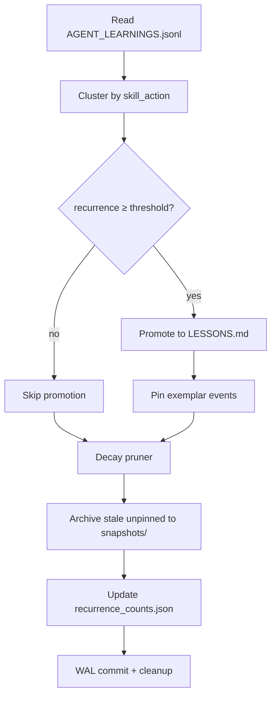

# `.agent/` — Portable Memory for AI Coding Agents

**Status:** v0.1-draft · 2026-05-26

Conformance keywords (MUST, SHOULD, MAY, MUST NOT) are used per [RFC 2119](https://www.rfc-editor.org/rfc/rfc2119).

## Thesis

`.agent/` is a directory convention any AI coding agent or harness can read from and write to in order to share runtime memory across tools. It sits beside [`AGENTS.md`](https://agents.md) and [`SKILL.md`](https://www.anthropic.com/news/skills) in a project root. This spec defines the folder layout, the JSON record schema, a salience formula for ranking recall, and a consolidation contract called the *dream cycle*. It does not mandate a storage engine, an LLM, a transport, or a daemon — those are implementation choices. **AGENTS.md is what you wrote down. `.agent/` is what your agent learned.**

## Relationship to `AGENTS.md` and `SKILL.md`

| File | Author | Role |
|---|---|---|
| [`AGENTS.md`](https://agents.md) | Human | Project rules, conventions, build/test commands. |
| [`SKILL.md`](https://www.anthropic.com/news/skills) | Human | Capability bundles invoked on demand. |
| `.agent/` | Machine | Evolving runtime memory: episodes, lessons, preferences. |

`.agent/` does not replace either. A project may use any combination of the three.

## Folder layout

A compliant `init` scaffolds:

```
.agent/
  working/      # Short-lived scratchpad for the active session. Format and lifecycle are implementation-defined. Implementations MAY omit `working/`.
  episodic/     # Append-only JSONL log of timestamped events. Canonical file: AGENT_LEARNINGS.jsonl.
  semantic/     # Lessons distilled from episodic by the dream cycle. Canonical file: LESSONS.md.
  personal/     # User preferences scoped to the human, not the project. Markdown. Implementations MUST NOT include `personal/` contents in any LLM invocation (local or remote) without explicit per-call user consent. The dream cycle MUST NOT distill `personal/` into `semantic/`.
```

All text files MUST be UTF-8. `.agent/` is checked into the project's repo. Implementations MAY keep derived state (indexes, snapshots, write-ahead logs) under a hidden subfolder such as `.<impl>/`; such state MUST be `.gitignore`d.

## Node schema (episodic)

Each line in `episodic/AGENT_LEARNINGS.jsonl` MUST deserialize into the following JSON shape:

```json
{
  "schema_version": "1.0.0",
  "id": "evt_01ARZ3NDEKTSV4RRFFQ69G5FAV",
  "timestamp": "2026-05-08T10:55:00Z",
  "source_harness": "claude-code",
  "skill_action": "rust::error_handling::axum_rejection",
  "content": "Axum requires custom Error types to implement IntoResponse. Do not use `unwrap()` in route handlers.",
  "pain": 7.5,
  "importance": 8.0,
  "pinned": false
}
```

**Required fields**

| Field | Type | Notes |
|---|---|---|
| `schema_version` | string | Exactly `"1.0.0"` for this revision of the schema. The SPEC version and `schema_version` evolve independently; the SPEC is currently v0.1-draft. |
| `id` | string | MUST be lexically sortable by creation time. ULID and UUIDv7 are the recommended formats. Assigned by the writer. |
| `timestamp` | string | ISO 8601 with explicit UTC offset (e.g., `2026-05-08T10:55:00Z`). |
| `source_harness` | string | Lowercase ASCII identifier matching `[a-z0-9_-]+`. Implementations MAY use any value; the following are reserved and MUST resolve to their canonical owner: `claude-code`, `cursor`, `cline`, `opencode`, `aider`, `continue`. New reserved values are added via RFC. |
| `skill_action` | string | Hierarchical clustering key. Segments match `[a-z0-9_]+`, separated by `::`. Total length ≤ 256 bytes. Implementations SHOULD lowercase. The dream cycle clusters on exact match. |
| `content` | string | Lesson body. Markdown allowed. Writers SHOULD keep `content` under 4 KiB; readers MUST accept up to 64 KiB. |
| `pain` | number | 0.0–10.0. Severity of the moment that produced this entry. See rubric below. |
| `importance` | number | 0.0–10.0. Strategic weight. See rubric below. |
| `pinned` | boolean | Default `false`. MAY be set to `true` by any writer to indicate the event MUST NOT be pruned. The dream cycle MUST set `pinned: true` on events cited by a promoted lesson, and MUST NOT unset a `pinned` value set by another writer. |

**Optional fields**

| Field | Type | Notes |
|---|---|---|
| `client_dedup_key` | string | Idempotency key; implementations MAY use it to drop duplicate appends. |

`recurrence` is **not** an event field. It is a per-cluster count (events sharing a `skill_action`) computed by the dream cycle and stored separately by the implementation.

**Pain and importance rubric (informative).** The 0.0–10.0 ranges are intentionally open. A starting rubric:

- Routine success: ≈ 2
- Recoverable failure: ≈ 5
- Hard failure: ≈ 7
- Constraint violation, security-relevant: ≈ 8–10

Implementations MAY adopt any rubric provided it is documented in the implementation's README.

**Forward compatibility.** Writers MAY include additional fields beyond those specified above and SHOULD prefix experimental field names with `x_` (lowercase). Readers MUST ignore unknown fields and MUST NOT halt on their presence.

**Corrupt input.** Readers MUST skip JSONL lines that fail schema validation and SHOULD log the line number and reason. Readers MUST NOT halt on the first invalid line.

**Secret redaction.** Writers SHOULD redact obvious secrets (high-entropy strings matching common token patterns, such as API keys and access tokens) from `content` before append. The spec does not mandate a redaction algorithm.

## Salience formula

Recall ranks results by:

```
salience    = exp(-age_days / 14) * (pain / 10) * (importance / 10) * (1 + ln(1 + recurrence))
final_score = bm25 * salience
```

`bm25` is the standard full-text relevance score for the query against `content`. `age_days` is derived from `timestamp` at query time; salience MUST NOT be pre-computed and stored, because the decay term changes continuously. `recurrence` is the count of events sharing the candidate's `skill_action` over a window the implementation defines.¹

## Dream cycle

The *dream cycle* is the consolidation pass that turns `episodic/` into `semantic/`. Inputs: the JSONL log plus per-cluster recurrence counts.



**Promotion.** A cluster is promoted when its recurrence exceeds an implementation-defined threshold over a recent window. The reference implementation uses ≥ 3 events in either a 7-day or 30-day window.

**Output format.** The dream cycle writes to `semantic/LESSONS.md`. The file MUST begin with a YAML frontmatter block followed by one lesson block per promoted cluster:

```
---
last_updated: "<ISO 8601 timestamp>"
prompt_version: "<string>"
cluster_key: "<skill_action>"
---
<!-- dreamd:lesson id="<id>" cluster="<skill_action>" -->
<lesson body>
<!-- /dreamd:lesson -->
```

The frontmatter block MUST contain `last_updated` (ISO 8601 UTC timestamp of the cycle run), `prompt_version` (implementation-defined; use `"deterministic-only"` for the network-free fallback), and `cluster_key` (the promoted cluster's full `skill_action` string). The `<!-- dreamd:lesson -->` opening tag MUST carry an `id` attribute set to the exemplar event's `id` and a `cluster` attribute set to the cluster's full `skill_action` string. The closing `<!-- /dreamd:lesson -->` tag MUST appear on its own line immediately after the lesson body. Implementations MAY emit multiple lesson blocks (one per promoted cluster) separated by blank lines.

**Distillation modes.** An implementation MAY use an LLM to author the lesson body. An implementation MUST also support a deterministic, network-free fallback. In deterministic mode, the lesson body is the `content` of the highest-`pain` event in the cluster (ties broken by highest `importance`, then by lowest `id`). Implementations MAY use richer deterministic strategies (extractive summarization, template merging) provided they remain pure functions of the input.

**Idempotency.** Running the cycle twice on identical input — including `pinned` state set by previous runs — MUST produce byte-identical `LESSONS.md` output.

**Pruning.** The dream cycle MAY prune unpinned episodic events whose salience falls below an implementation-defined threshold. Pruned events MUST be moved to the implementation's hidden subfolder (e.g., `.<impl>/snapshots/`), never deleted, retaining the ability to reverse a prune. Pinned events MUST NOT be pruned.

## Concurrency and file operations

Writers MUST use OS-atomic append when writing to `episodic/AGENT_LEARNINGS.jsonl` (`O_APPEND` on POSIX; equivalent atomic-append behavior on Windows). Each JSONL line MUST be written in a single append call and MUST end with a single `\n`.

The spec does not require file locking. Implementations that need stronger guarantees MAY layer locking on top, but lock files MUST live under the implementation's hidden subfolder (`.<impl>/`) and MUST NOT block readers that ignore them.

Implementations that maintain derived indexes MUST tolerate out-of-band edits to `episodic/AGENT_LEARNINGS.jsonl` (e.g., a `git pull` brings in new events). The recommended pattern is mtime-watching or content hashing; the spec does not mandate a mechanism.

## Scope

**In scope.** Folder layout, node schema, salience formula, dream-cycle contract.

**Out of scope.** Which LLM (or none) is used; how content is indexed; whether there is a long-running daemon; transport (stdio, HTTP, Unix socket, [MCP](https://modelcontextprotocol.io/)); service lifecycle; authentication. Implementations are free to differ on all of these.

## Versioning

This SPEC is **v0.1-draft**; breaking changes are possible before v1.0. The `schema_version` field in episodic records evolves independently of the SPEC version. After SPEC v1.0, `schema_version` follows semver, and any breaking change requires a documented migration path.

**Migration ownership.** Migrations are the writer's responsibility. A writer encountering a lower-versioned log MAY rewrite the file in place, but MUST preserve every original `id`, `timestamp`, and `pinned` value.

**Proposing changes.** Open a GitHub issue with the prefix `[RFC]` on the reference implementation.

## Reference implementation

[`dreamd`](https://github.com/botzrDev/dreamd) — a local-first, single-binary tool that implements this spec via MCP, CLI, and an optional dream-cycle service. Other implementations are welcome and intended; `.agent/` is a contract, not a product.

---

¹ The shape — exponential decay, multiplicative pain × importance, log-scaled recurrence — follows the activation function in [ACT-R](http://act-r.psy.cmu.edu/about/) and the memory-stream retrieval used in [Park et al., *Generative Agents* (2023)](https://arxiv.org/abs/2304.03442).
